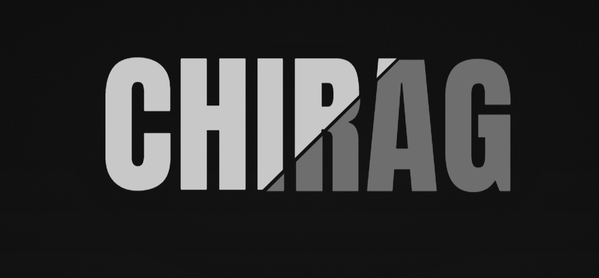

  

  <h3>Full-Stack Developer & Creative Technologist</h3>
  
Building immersive digital experiences with code, motion & aesthetics

 

  
  &nbsp;
  
  &nbsp;
  

 

---
### 🌌 About Me
Passionate developer based in Bengaluru, specializing in **cybersecurity**, **3D web experiences**, and creating elegant, futuristic interfaces.

### 🛠️ Skills & Technologies

  
  
  
  
  
  
  
  
  
  

---

### 📈 GitHub Progress

  

  

---

### ✨ Featured Projects

  <table>
    <tr>
      <td align="center" valign="top">
        <!-- SecurePass -->
        
      </td>
      <td align="center" valign="top">
        <!-- ZPlus -->
        
      </td>
    </tr>
  </table>

**SecurePass** — Zero-knowledge password manager engineered for military-grade security. End-to-end encrypted vault with biometric + passkey authentication, real-time device sync, and absolute user data control. Built with zero-knowledge architecture.

**[→ Explore SecurePass →](https://github.com/ch-irax/SecurePass)**

**ZPlus** — Futuristic 3D portfolio platform with immersive, interactive design. Real-time WebGL rendering, advanced particle systems, physics simulations, and smooth GSAP animations create an unforgettable, premium-feeling experience for creatives and technologists.

**[→ Explore ZPlus →](https://github.com/ch-irax/zplus)**

---

