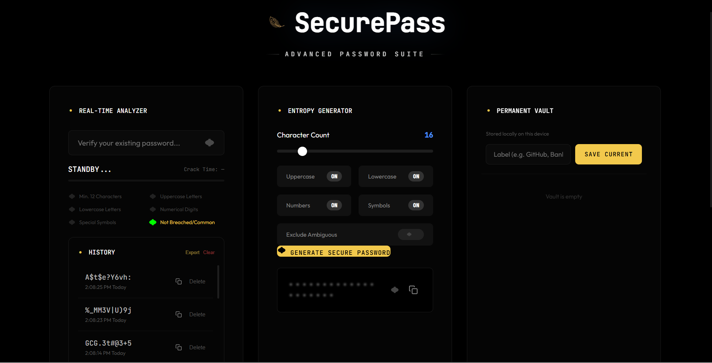
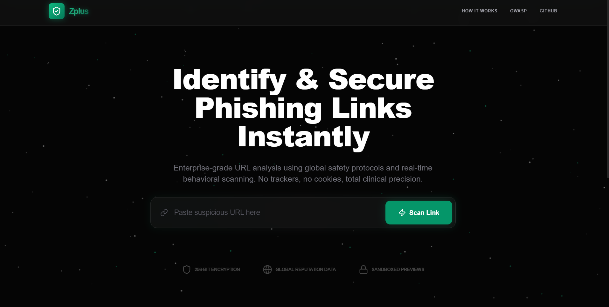

  

  <h1>Chirag Sharma</h1>
  <h3>Full-Stack Developer & Creative Technologist</h3>
  
Building immersive digital experiences with code, motion & aesthetics

 

  
  
  

---

### 🌌 About Me

Passionate developer based in Bengaluru, specializing in **cybersecurity**, **3D web experiences**, and creating elegant, futuristic interfaces.

---

### 🛠️ Skills & Technologies

---

### 📈 GitHub Progress

  

  

---

### ✨ Featured Projects

  <!-- SecurePass -->
  

  <!-- ZPlus -->
  

**SecurePass** — Advanced password suite with real-time analysis & entropy generation.

**ZPlus** — [Add short description here — e.g. "Modern productivity tool" or whatever it is]

**[→ Explore SecurePass →](https://github.com/ch-irax/SecurePass)**  
**[→ Explore ZPlus →](https://github.com/ch-irax/zplus)**

---

### 🎵 Now Playing

  

---

  

